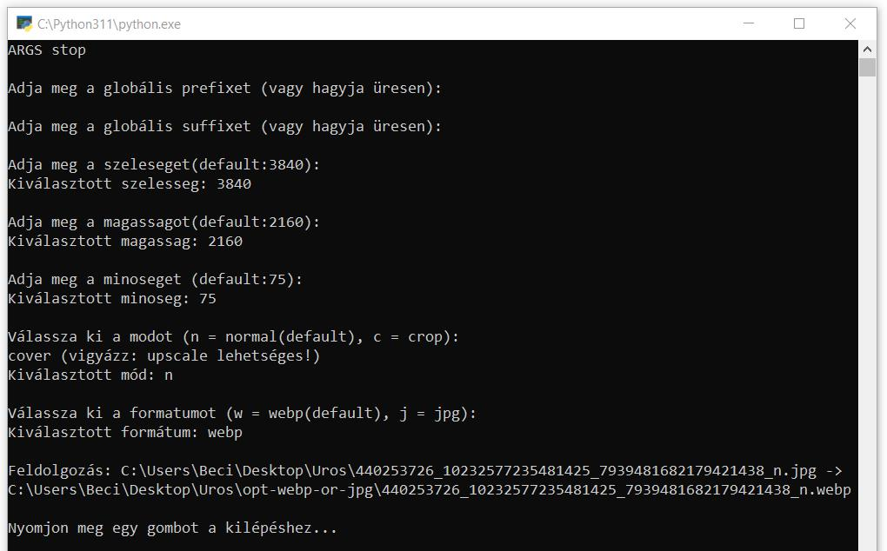

# Kép (fájl/fájlok és/vagy mappa/mappák) konvertáló/optimalizáló webp vagy jpg formátumra. Python program.

Ez a Python script képek átméretezésére és konvertálására szolgál. A program parancssori argumentumokat használ a feldolgozandó könyvtárak és fájlok meghatározásához, miközben különböző paramétereket és beállításokat alkalmaz. Az alábbiakban részletesen ismertetjük a program működését és funkcióit.

## Fő funkciók és feladatok

### 1. Input Bekérés

A program a felhasználótól különböző paramétereket kér be:

- **Globális prefix**: Egy előtag, amely minden fájl nevéhez hozzáadódik.
- **Globális suffix**: Egy utótag, amely minden fájl nevéhez hozzáadódik.
- **Képszélesség**: Az átméretezés során használt szélesség (alapértelmezett: 3840).
- **Képmagasság**: Az átméretezés során használt magasság (alapértelmezett: 2160).
- **Minőség**: A kimeneti kép minősége (alapértelmezett: 75).
- **Mód**: Két lehetőség: normál (n) vagy crop (c). A normál mód arányosan méretezi át a képeket, míg a crop mód középre igazítva vágja őket a megadott méretre.
- **Formátum**: A kimeneti fájl formátuma, amely lehet webp (alapértelmezett) vagy jpg.

### 2. Prefix és Suffix Meghatározása

A `get_prefix_suffix` függvény ellenőrzi, hogy van-e megadott globális prefix vagy suffix. Ha nincs, akkor a fájl könyvtárában lévő `prefix.txt` és `suffix.txt` fájlokat próbálja meg beolvasni, és ezek alapján állítja be a prefixet és suffixet.

### 3. Kép Átkonvertálása

A `convert_image` függvény az ImageMagick segítségével átméretezi és átkonvertálja a képeket. Két módot támogat:

- **Normál mód**: Arányosan méretezi át a képeket a megadott szélességre és magasságra.
- **Crop mód**: A megadott méretre vágja és középre igazítja a képeket.

### 4. Könyvtár Feldolgozása

A `process_directory` függvény végigmegy a megadott könyvtár összes `.jpg` kiterjesztésű fájlján, és ezeket az előzőleg meghatározott paraméterekkel átkonvertálja. Az új fájlokat egy `opt-webp-or-jpg` nevű alkönyvtárba menti.

### 5. Fő Program

A `main` függvény a következőket teszi:

- Parancssori argumentumok kiírása.
- Globális prefix és suffix bekérése.
- Képszélesség, magasság, minőség, mód és formátum bekérése.
- Megadott könyvtárak és fájlok feldolgozása.
- Feldolgozás után vár a felhasználó gombnyomására a kilépéshez.

## Használat

A program futtatásához használja a következő parancsot:

```
python script_neve.py [konyvtar_vagy_fajl_1] [konyvtar_vagy_fajl_2] ...
```

Ez a parancs a kepek könyvtárban található összes .jpg fájlt átméretezi és átkonvertálja a megadott paraméterek alapján.


# CLI képernyőmentés



# Win10 kontextusmenüből és küldés kontextusból elérhető

...a segédfájlokkal.

- KepKonvForFilesOrDirs.reg

A `KepKonvForFilesOrDirs.reg` fájl olyan Windows regisztrációs beállításokat tartalmaz, amelyek lehetővé teszik, hogy a programot közvetlenül a fájlkezelő (Windows Explorer) kontextus menüjéből futtassuk. Ez azt jelenti, hogy a felhasználó jobb kattintással elérheti a képátméretező és konvertáló funkciókat a kiválasztott fájlokon vagy könyvtárakon.

- KepKonvForFilesOrDirs-SendTo.bat

