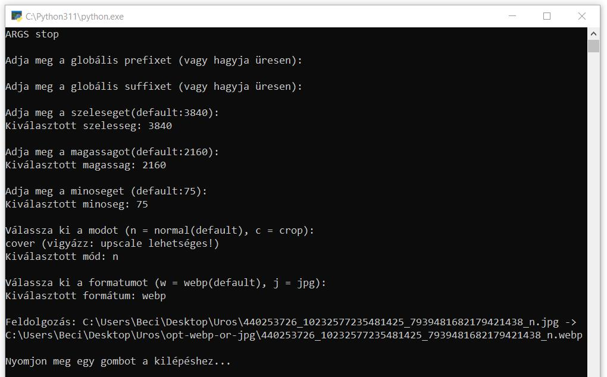
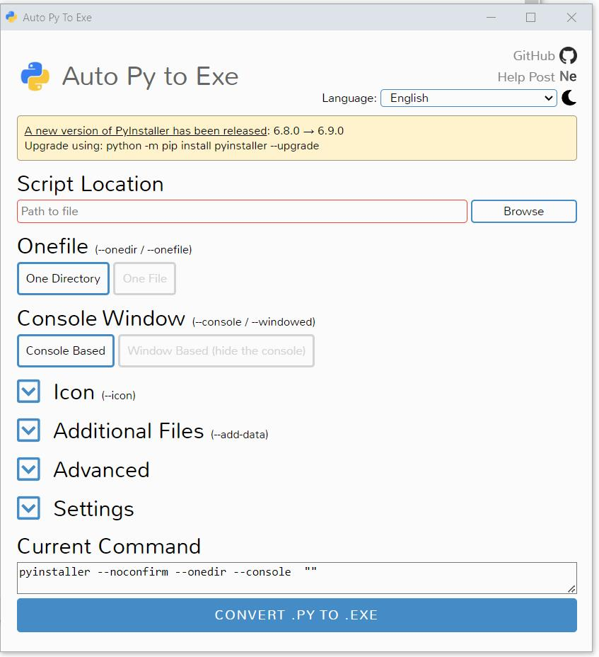

# Kép (fájl/fájlok és/vagy mappa/mappák) konvertáló/optimalizáló WebP, JPG vagy AVIF formátumra. Python program.

Ez a Python script képek átméretezésére és konvertálására szolgál. A program parancssori argumentumokat használ a feldolgozandó könyvtárak és fájlok meghatározásához, miközben különböző paramétereket és beállításokat alkalmaz. Az alábbiakban részletesen ismertetjük a program működését és funkcióit.

## Fő funkciók és feladatok

### 1. Input Bekérés

A program a felhasználótól különböző paramétereket kér be:

- **Globális prefix**: Egy előtag, amely minden fájl nevéhez hozzáadódik.
- **Globális suffix**: Egy utótag, amely minden fájl nevéhez hozzáadódik.
- **Képszélesség**: Az átméretezés során használt szélesség (alapértelmezett: 3840).
- **Képmagasság**: Az átméretezés során használt magasság (alapértelmezett: 2160).
- **Minőség**: A kimeneti kép minősége (alapértelmezett: 75).
- **Mód**: Normál (n, alapértelmezett), crop (c) vagy contain (t). A normál mód arányosan kicsinyít, a crop kitölti és középre igazítva vágja a képet, a contain arányos beillesztéssel és háttérkitöltéssel állítja elő a megadott méretet.
- **Formátum**: WebP (w, alapértelmezett), JPG (j) vagy AVIF (a).

### 2. Prefix és Suffix Meghatározása

A `get_prefix_suffix` függvény ellenőrzi, hogy van-e megadott globális prefix vagy suffix. Ha nincs, akkor a fájl könyvtárában lévő `prefix.txt` és `suffix.txt` fájlokat próbálja meg beolvasni, és ezek alapján állítja be a prefixet és suffixet.

### 3. Kép Átkonvertálása

A konverter az ImageMagick segítségével átméretezi és átkonvertálja a képeket. Három módot támogat:

- **Normál mód**: Arányosan méretez, a megadott szélességen és magasságon belül, nagyítás nélkül.
- **Crop mód**: Kitölti a megadott méretet, majd középre igazítva vág; szükség esetén nagyít.
- **Contain mód**: Arányosan beilleszt, szükség esetén nagyít, a fennmaradó területet a választott háttérszínnel tölti ki.

### 4. Könyvtár Feldolgozása

A program a megadott könyvtárak közvetlen `.jpg`, `.jpeg` és `.png` fájljait dolgozza fel, nem rekurzívan. Üres célmappabeállításnál a kimenetek a forrás melletti `opt-webp-or-jpg` alkönyvtárba kerülnek (AVIF esetén is), egyébként a megadott közös célmappába.

### 5. Fő Program

A `main` függvény a következőket teszi:

- Parancssori argumentumok kiírása.
- Globális prefix és suffix bekérése.
- Képszélesség, magasság, minőség, mód és formátum bekérése.
- Megadott könyvtárak és fájlok feldolgozása.
- Feldolgozás után vár a felhasználó gombnyomására a kilépéshez.

## Használat

### Párhuzamos konvertálás

A gyorsítás automatikus: egyszerre legfeljebb **6 kép** konvertálódik, képenként **2 ImageMagick-szállal**. A tényleges párhuzamosság `min(képek száma, 6, magok száma / 2)`, tehát gyengébb processzoron a program kevesebb munkát indít; egyetlen kép feldolgozásánál megmarad az ImageMagick saját szálbeállítása.

A képenkénti memórialimit indításkor megadható, alapértelmezése **15 GB**. Ez a pixelgyorsítótár felső korlátja, nem lefoglalás: az ImageMagick csak annyit használ, amennyi az adott képhez kell, és a limit elérésekor kezd lemezre dolgozni. A memóriába leképezett fájlok korlátja ennek a kétszerese. A kodekek és más belső adatok ezen felül is igényelhetnek memóriát.

Tipikus mobilfotóknál (12–50 megapixel) a limit emelése önmagában nem gyorsít, mert ekkora képek a régi 2 GiB-os korlátot sem közelítik meg; a mért gyorsulás a párhuzamos képek számából jön. A magas alapérték a nagyon nagy (több száz megapixeles) képeknél számít, ahol megakadályozza a lemezre dolgozást. A munkasor legfeljebb a dolgozók számának kétszeresét tartalmazza (itt 12 feladat), ezért sok ezer bemenetnél sem indul egyszerre korlátlan számú konverzió. A teljes fájllista előzetes ellenőrzése csak fájlneveket és feladatleírásokat tárol, nem tölti be az összes képet a memóriába.

A befejezett képek dátumait a fő szál állítja be egyetlen ExifTool-folyamattal, miközben a következő képek konverziója már futhat. A folyamatjelző a befejezett képeket számolja, így a képek nem feltétlenül a bemeneti sorrendben készülnek el. A végén külön konverziós és dátumkezelési összesítés jelenik meg.

**Felülírásvédelem:** a teljes bemeneti listán, még az indítás előtt megtörténik a célnevek ellenőrzése. Ismételt bemenetből csak az első példány kerül feldolgozásra. Névütközésnél az első bemenet kapja a célnevet, a továbbiak indoklással kimaradnak; a mappákon belül név szerinti sorrendet használ a program. A már létező célfájlokat szintén kihagyja, ezért új beállításokkal történő ismételt konverzióhoz másik célmappát vagy elő-/utótagot válassz. A PNG korábbi névkiegészítése megmarad (`kep.png.webp`), és az ellenőrzés ezzel együtt vizsgálja az ütközéseket.

A kép először a célmappában létrehozott ideiglenes fájlba készül. Csak sikeres konverzió után kapja meg a végleges nevét, felülírás nélkül; ez az időközben létrejött célfájlt is védi. Hibánál a program eltávolítja a saját ideiglenes kimenetét és folytatja a többi képpel.

**Helyi mérés bekapcsolt dátummegőrzéssel:** 6 darab 4000×3000-es, mesterséges mintázatú JPEG-ből, 3840×2160-as normál móddal és 75-ös minőséggel:

| Kimenet | Soros feldolgozás | Párhuzamos feldolgozás | Gyorsulás |
| --- | ---: | ---: | ---: |
| JPG | 4,10 mp | 2,45 mp | 1,68× |
| WebP | 6,71 mp | 3,30 mp | 2,04× |

A mérés az átméretezést, kódolást, dátummásolást és az ExifTool indítását/leállítását is tartalmazza. A két változat fájljai ebben a próbában bájtról bájtra megegyeztek. Más képek, meghajtók vagy AVIF-kimenet esetén a gyorsulás eltérhet.

**A szálszám és a memórialimit külön mérve** (12 darab 4032×3024-es JPEG → 3840×2160 WebP, q75, dátummásolás nélkül):

| Beállítás | Idő |
| --- | ---: |
| 3 párhuzamos kép, 2 GB limit (korábbi) | 6,47 mp |
| 3 párhuzamos kép, 15 GB limit | 5,82 mp |
| 6 párhuzamos kép, 2 GB limit | 3,90 mp |
| 6 párhuzamos kép, 15 GB limit (jelenlegi) | 4,00 mp |

A gyorsulás gyakorlatilag teljes egészében a párhuzamos képek számából származik (1,66×); a memórialimit ekkora képeknél a mérési hibán belül van. 12 párhuzamos kép már nem hozott további gyorsulást (4,13 mp), ezért maradt a 6-os alapérték.

### GPU-gyorsítás

**A konverzió nem használ GPU-t, és a mérés szerint nem is érdemes.** Az ImageMagick ezen a gépen OpenCL-támogatással készült, de bekapcsolva (`MAGICK_OCL_DEVICE=TRUE`) a fenti próba **lassabb** lett: 4,74 mp a 4,00 mp helyett. Ennek okai:

- OpenCL-en csak néhány pixelművelet fut (átméretezés, konvolúció); a JPEG/WebP/AVIF **kódolás és dekódolás CPU-n marad**, és a mi feladatunkban ez viszi az időt.
- A képek másolgatása a GPU memóriájába és vissza többe kerül, mint amennyit a néhány milliszekundumos átméretezésen nyerünk.
- Hideg kernel-gyorsítótárral a 6 párhuzamos ImageMagick-folyamat **egymásra is írt**: `unable to write blob ... magick_opencl_NVIDIA_....bin: File exists` hibával több konverzió elhasalt.

Érdemi GPU-gyorsulást csak más eszközzel lehetne elérni (például NVIDIA NVJPEG-alapú dekódolás), ami az ImageMagick-alapú feldolgozás lecserélését jelentené; a jelenlegi képméreteknél ez nem térülne meg.

### Mobilos készítési idő megőrzése

A **„Mobilos készítési idő megőrzése (EXIF + módosítás dátuma)?”** opciónál az `i` (alapértelmezés) a következőt jelenti:

- A forrás EXIF `DateTimeOriginal` készítési idejét átmásolja a kimenetbe, JPG, WebP és AVIF esetén is. A rendelkezésre álló időzóna és másodperctöredék is megmarad; az eredeti többi EXIF dátummezőt is másolja.
- A kimeneti fájl **módosítási idejét a fotó készítési időpontjára** állítja. A forrás módosítási idejéből nem készít helyettesítő fotózási dátumot.
- Hiányzó vagy hibás készítési időnél külön jelzést ad. Hiányzó időzónánál az EXIF-ben tárolt idő változatlan marad, a fájl módosítási idejét pedig a számítógép helyi időzónája szerint állítja be. A készítéskori időzóna ilyenkor nem állapítható meg biztosan.
- A fájlrendszer szerinti **létrehozási időt nem állítja át**.
- `n` választásakor nem indul ExifTool és nincs külön dátummásolás. Ez nem metaadat-törlési opció: a konverzió által eleve megtartott mezők megmaradhatnak.

Az ExifTool egyszer indul el a teljes feldolgozáshoz, és képenként azonnal beállítja a dátumokat. A végén összesíti a sikeres másolásokat, a hiányzó készítési dátumokat, a hibákat és a helyi időzónával kezelt képeket. Sikertelen konverzió után nincs dátummásolás; a forrással azonos célfájlt a konverter kihagyja.

**Windows Intéző:** a „Készítés dátuma” és az általános „Dátum” megjelenése függ a telepített formátumtámogatástól. A helyi ellenőrzésben a Windows a JPG készítési dátumát kiolvasta, a WebP/AVIF EXIF készítési dátumát nem. A **„Módosítás dátuma” oszlop mindhárom kimenetnél a beállított fotózási időt tartalmazza**, ezért egységes rendezéshez ezt használd. Időzónát tartalmazó képnél a fájlrendszer-idő megjelenítése a Windows helyi időzónáját követi; az EXIF őrzi az eredeti helyi készítési időt és az eltolást.

**Sebességmérés:** 20 kis próbakép dátumkezelése ezen a gépen az új megoldással 1,01 másodperc volt; a korábbi, fájlonként újraindított ExifToollal 13,40 másodperc. Ez nem a teljes képkonverzió ideje, és nagy képeknél, más meghajtón vagy formátumnál eltérhet.

Az új `photo_dates.py` modult a konverter mellett kell tartani. Az ellenőrzések futtatása telepített ImageMagick és a mellékelt ExifTool mellett:

```powershell
python -m unittest -v test_photo_dates test_parallel_conversion
```

### Indítás

A program futtatásához használja a következő parancsot:

```
python KepKonvForFilesOrDirs.py [konyvtar_vagy_fajl_1] [konyvtar_vagy_fajl_2] ...
```

Ez a parancs a megadott képfájlokat és a megadott mappák közvetlen JPG/JPEG/PNG képeit konvertálja a bekért paraméterek alapján.


# CLI képernyőmentés



# Win10 kontextusmenüből és küldés kontextusból elérhető

...a segédfájlokkal.

- KepKonvForFilesOrDirs.reg

A `KepKonvForFilesOrDirs.reg` fájl olyan Windows regisztrációs beállításokat tartalmaz, amelyek lehetővé teszik, hogy a programot közvetlenül a fájlkezelő (Windows Explorer) kontextus menüjéből futtassuk. Ez azt jelenti, hogy a felhasználó jobb kattintással elérheti a képátméretező és konvertáló funkciókat a kiválasztott fájlokon vagy könyvtárakon.

- KepKonvForFilesOrDirs-SendTo.bat

# Python to Win10 exe

Disable Antivirus(Avat) for 10 mins

auto-py-to-exe 


